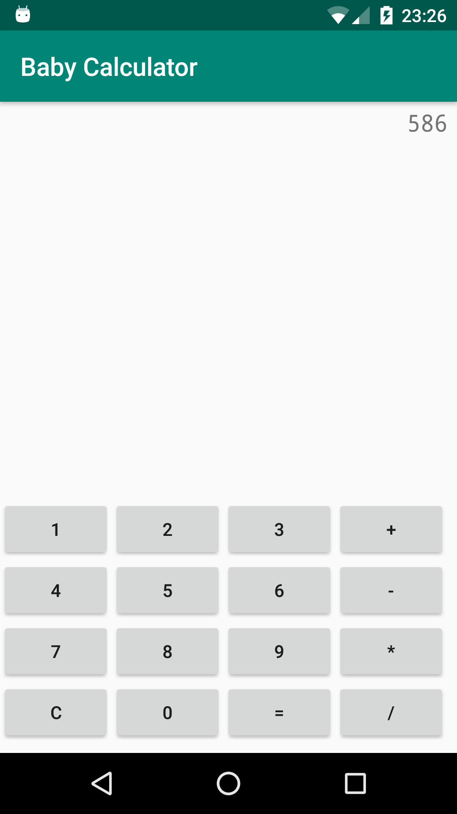

# BabyCalculator
My first Android app - a baby calculator!

## Instructions
OpenClassrooms: [Developpez des applications Android connectées](https://openclassrooms.com/fr/courses/4428411-developpez-des-applications-android-connectees)

TP: [Codez votre propre calculatrice de poche](https://openclassrooms.com/fr/courses/4428411-developpez-des-applications-android-connectees/4428451-tp-codez-votre-propre-calculatrice-de-poche)

## Screenshots

  

